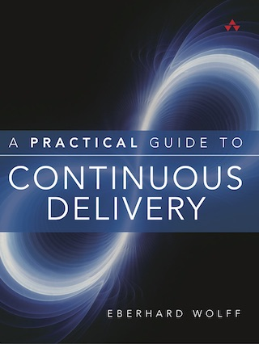

A Practical Guide to Continuous Delivery
---

 

### Continuous Delivery

Continuous Delivery allows for faster and more reliable deployment of
software in production. The foundation is a Continuous Delivery
pipeline that automates the deployment process. This enables a
reproducible, low-risk process to bring new releases into production.

### The Book

The book is a 100% practical guide to building Continuous Delivery
pipelines that automate rollouts, improve reproducibility, and
dramatically reduce risk.

It introduces a proven Continuous Delivery technology stack, including
Docker, Chef, Vagrant, Jenkins, Graphite, the ELK stack, JBehave, and
Gatling. The book guides you through applying these technologies throughout
build, continuous integration, load testing, acceptance testing, and
monitoring. Wolff’s start-to-finish example projects offer the basis
for your own experimentation, pilot programs, and full-fledged
deployments.

* Understand the problems that Continuous Delivery solves, and how it
solves them.

* Establish an infrastructure for maximum software automation

* Leverage virtualization and Platform as a Service (PAAS) cloud solutions

* Implement build automation and continuous integration with Gradle,
  Maven, and Jenkins

* Perform static code reviews with SonarQube and repositories to store
  build artifacts

* Establish automated GUI and textual acceptance testing with
  behavior-driven design

* Ensure appropriate performance via capacity testing

* Check new features and problems with exploratory testing

* Minimize risk throughout automated production software rollouts

* Gather and analyze metrics and logs with Elasticsearch, Logstash,
  Kibana (ELK), and Graphite

* Manage the introduction of Continuous Delivery into your enterprise

* Architect software to facilitate Continuous Delivery of new capabilities

### Author

Eberhard Wolff , a Fellow at innoQ in Germany, has more than 15 years
of experience as an architect and consultant working at the
intersection of business and technology. He gives talks and keynotes
at international conferences, has served on multiple
conference program committees, and has written more than 100 articles
and books. His technological focus is on modern architectures—often
involving cloud, Continuous Delivery, DevOps, microservices, and
NoSQL.  He is author of
[Microservices: Flexible Software Architecture](http://microservices-book.com).

Bastian Spanneberg has written chapter 3. He is a Senior Engineer at
Instana where he works on platform architecture and automation. His Twitter handle is @spanneberg.

### Example Project

You can find the example project on Github:
 [https://github.com/ewolff/user-registration-V2](https://github.com/ewolff/user-registration-V2) .

